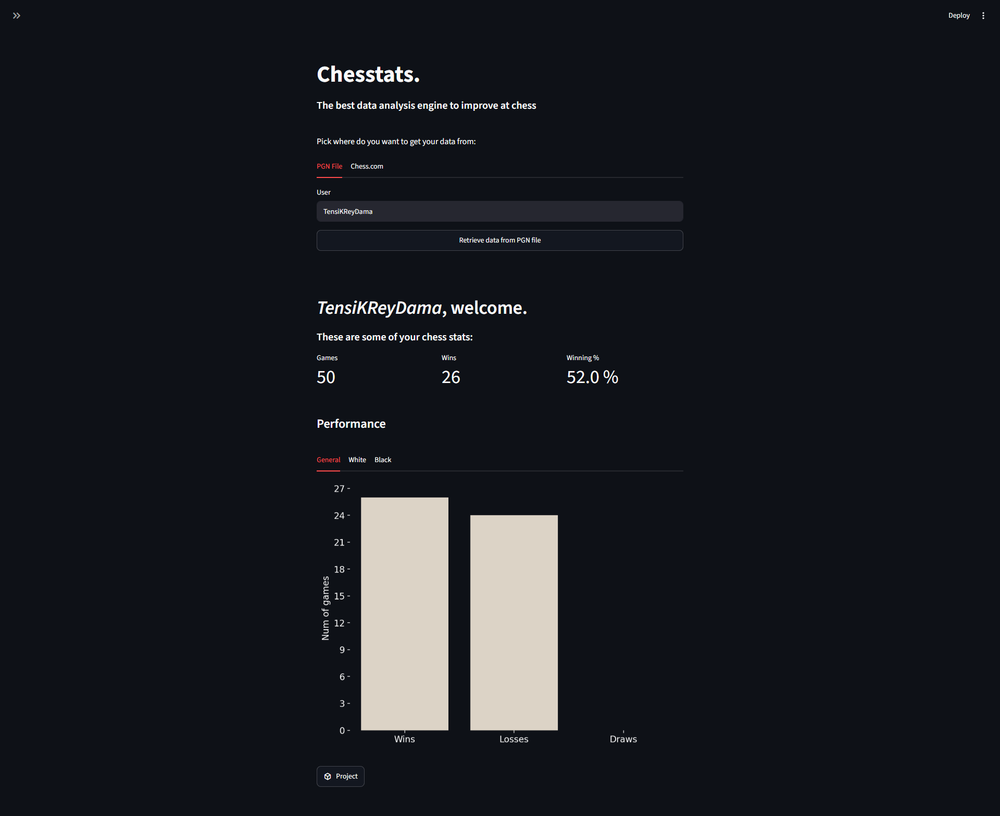
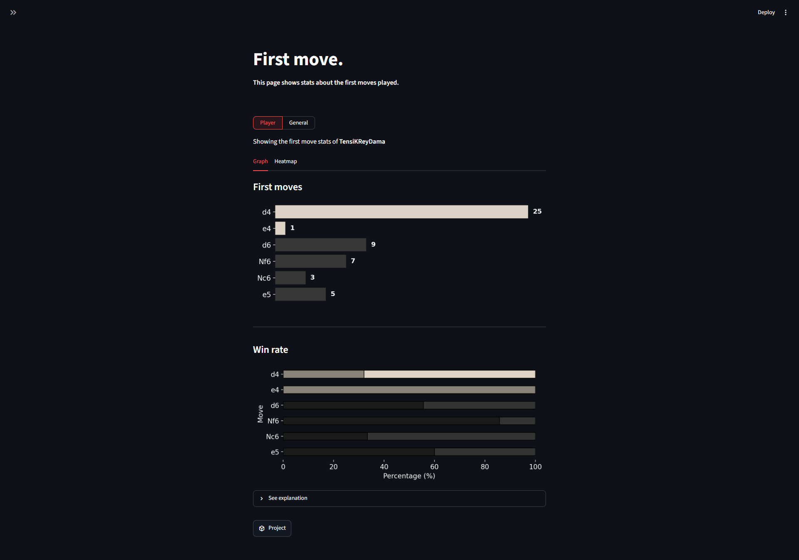

# Chesstats.

Chesstats is a data analysis tool that helps you visualize and understand different aspects of your chess games. Right now, it works using PGN files, containing the information of different chess games from one or more users. The PGN file can be uploaded or retrived from Chess.com. The tool consists of an interactive dashboard that guides you through all the different stats of the games.

---

## 📊 Dashboard




---

## 🚀 Main features

- Data retrievable from PGN files or Chess.com
- Dynamic selection of data (General view vs. Specific player)
- First move frequency analysis
- Performance graphs and win rate of openings (with stacked percentages)
- Clean interface with dark mode support

---

## 🛠 Technologies and libraries used

- Python 3.12
- Streamlit (front-end)
- Seaborn and Matplotlib (graphs)
- python-chess (PGN processing engine)

---

## 📦 Requirements and installation

Follow these simple steps in order to install chesstats on your computer:

#### 1. Clone the github repository

```
git clone https://github.com/angelrbl/chesstats.git
cd chesstats
```

#### 2. Install the dependencies

```
pip install python-chess matplotlib seaborn streamlit numpy
```

That's it, now you have installed chesstats.

#### 3. Execute chesstats

```
streamlit run dashboard.py
```

---

## 📂 Project structure

```chesstats/
├── pages/
│ └── 1_First_move.py
├── data/
│ └── chess-games.pgn
├── images/
│ └── dashboard.jpg
│ └── first_move.jpg
├── graphs.py        # Advanced graph generation using Seaborn
├── Dashboard.py     # Entry point of Streamlit front-end
├── ChessGame.py     # Chess Game logic
├── Player.py        # Player logic
├── general.py       # PGN exctractin logic and general stats
├── requirements.txt
└── README.md
```

---

## 🧑💻 Credits

@angelrbl: Project designed with analitic purposes and data science learning applied to chess.
